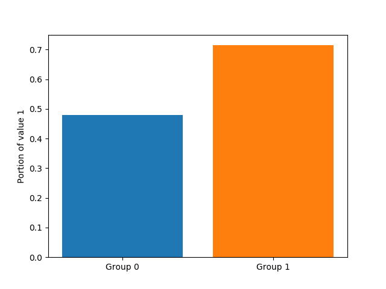
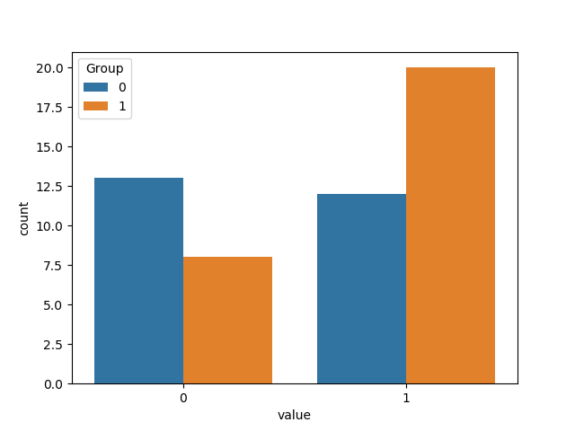

## Artificial Examples
Current versioin of the package provides 5 pre-implimented models:
- Binary observations: Bernoulli distribution with Beta prior
- Multiple Binary observations: Binomial distribution with Beta prior
- Metric observations: T-Student distribution with muliple priors
- Count observations: Negative Binomial distribution with Normal prior
- Ordinal observations: Normal distribution with variable tresholds

These models capture a lot of common assumption on observed data. Note that if you have specific information on your observation or other assumptions, it is highly recommended that you add your costum model. If you have model in mind that is a general model and other researchers (expecially within NLP community) are likely to need, feel free to ask us to add to the pakcage.

### Binary observations: Bernoulli distribution with Beta prior
For this model, you can indicate the "countPlot" and "barPlot" to view a vizualisation of the input. For our contrived data, we get the Figures 1 and 2.

### Multiple Binary observations: Binomial distribution with Beta prior

### Metric observations: T-Student distribution with muliple priors

### Count observations: Negative Binomial distribution with Normal prior

### Ordinal observations: Normal distribution with variable tresholds
