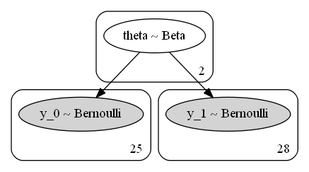
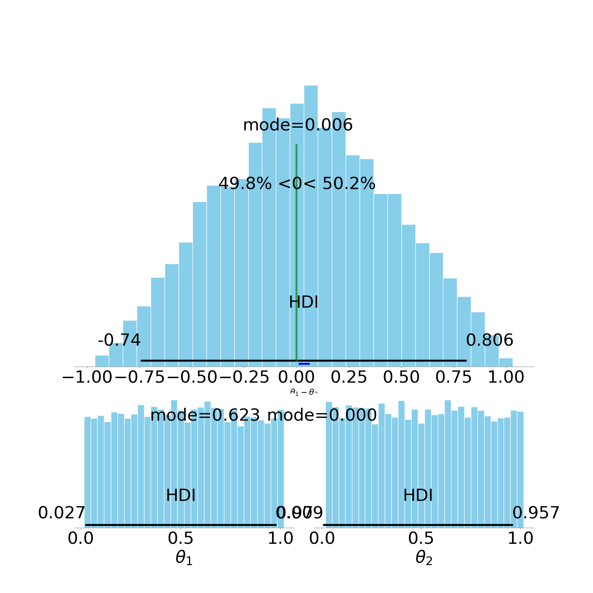
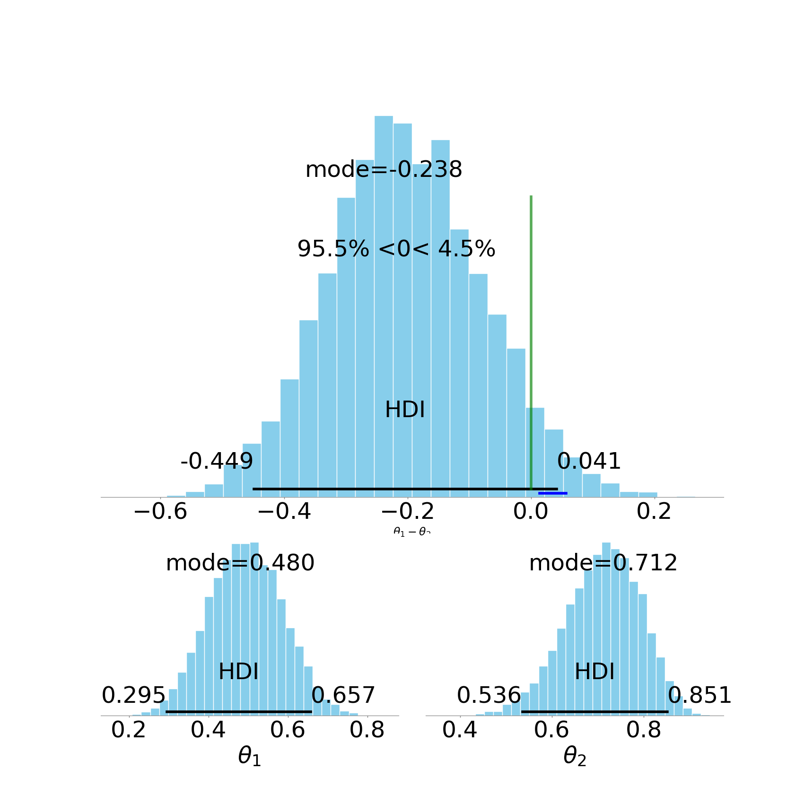
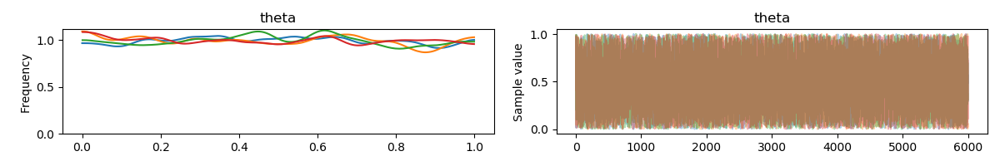
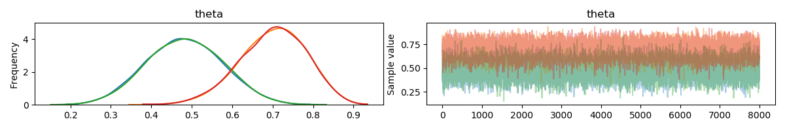

## Artificial Examples
Current versioin of the package provides 5 pre-implimented models:
- Binary observations: Bernoulli distribution with Beta prior
- Multiple Binary observations: Binomial distribution with Beta prior
- Metric observations: T-Student distribution with muliple priors
- Count observations: Negative Binomial distribution with Normal prior
- Ordinal observations: Normal distribution with variable tresholds

These models capture a lot of common assumption on observed data. Note that if you have specific information on your observation or other assumptions, it is highly recommended that you add your costum model. If you have model in mind that is a general model and other researchers (expecially within NLP community) are likely to need, feel free to ask us to add to the pakcage.

### Binary observations: Bernoulli distribution with Beta prior
For this model, you can indicate the "countPlot" and "barPlot" to view a vizualisation of the input. For our contrived data, we get the Figures 1 and 2.

#### Model
To indicate this model in the config file, it is enought to set the arguments "VariableType" and "PriorModel" to "Binary" and "Beta" in the "[Model]" section of the config file.

By indicating this model, the observatons of two groups are assumed to be follow two seperate Bernoulli distributions with paramters $$theta_1$$ and $$theta_2$$, corresponding to each group. Each parameter is the indicater of overall performance of corresponding group. Thus the distribution of $$theta_1-theta_2$$ indicates how supperiour group one is over group two. 

In a higher level, these two parameters are assumed to follow two Beta distribution with identical parameters. The parameters of this Beta distriution, i.e., priors of thetas, can be indicated with "Beta_a" and "Beta_b" in the "[Model]" section of the config file. Note setting both these parameters two one will yeailed a uniform prior.

See a vizualization of this model in Following Figure:

To check the effect of this model. One can see the Prior of distribution of each theta and their difference in the following Figure: 

Notice that before taking the observed data into account, our prior knowledge, in this case, is formalized as any value between zero and one for each theta is equally liklely.
#### Posteriour Plots
The main output of the analysis is the following Figure.

Notice that the mode of the the difference of the distribution is at $$-0.238$$, also known as Maximum A priori Estimate, the %95-HDI quantifies the uncertainty around this mode, which is the main goal of this analysis.

Other information that can be read from this plot includes:
- The probablity that group 2 is superiour than group 1, i.e., $$Theta_2>Theta_1$$ is at least $$95%$$.
- 
#### Diagnostic Plots
Since this package is based on MCMC sampling methods for infering the posteriour, it is important to make sure the sampling process has been done with sufficient granularity. For this purpose you can investigate the diagnastic plots produced by Pymc3:

Notice that different chains for each parameter as converged to one distribution.

The parameters affecting granularity of the analysis can be indicated in sections "[Prior]" and "[Posteriour]" in the config file. Especially, the following three parameters are the most important ones:
- "Tune": number of samples to throw away in the beginning. A value of at least 500 is recommended.
- "Chains": number independent chains. Four chains seem to be sufficent to confirm successful convergence of the chains.
- "Draws": This is the number of samples used to plot the distribution. The higher this value, the smooth the plot will look like. Also you can consult the Effective Sample Size (ESS) printed in the log.

#### Bayes Factor (BF)
The package also outputs the Bayes Factor for several lengths of intervals around the ROPE.

### Multiple Binary observations: Binomial distribution with Beta prior
Ungoing work!

### Metric observations: T-Student distribution with muliple priors
Ungoing work!

### Count observations: Negative Binomial distribution with Normal prior
Ungoing work!

### Ordinal observations: Normal distribution with variable tresholds
Ungoing work!

## Adding a new Model
Ungoing work!

