# User Manual for HyPyThesis

(TODO: Shorten this introduction)
A Bayesian hypothesis assessment framework, tailored to comparing the performances of algorithm pairs. This package is preliminary implementation statistical analyses described in [OUR Paper].
Also this package can be seen as a complimentary package to [https://github.com/rtmdrr/testSignificanceNLP] where the frequentest approaches are implemented. We followed the simple file format that the previous package required.

Similar to the previous package we focus on the setup where the performance of two algorithms, A and B, applied on a dataset X, is compared based on an evaluation measure M. Although here, when making such comparison, we study the posterior probabilities instead of performing a significance test.   
In the paper, we provide a comparison these two categories of approaches and advocate for including the Bayesian analysis (weather along with or in substitution to frequentest approaches).
Both these approaches help a researcher claim superiority of one algorithm over another from different aspects.

## Table of contents
(TODO: I don't know how to make them good links)
- [Installation](#heading)
- [Preparing Artificial Data]
- [Prepare Configuration File]
- [Running the analysis ]
- [Examples]
  * [Binary Model]
  * [Binomial Model]
  * [Metric Model]

## Installation
Check [README](../README.md).
## Preparing Artificial Data
For purposes of this manual, we make some artificial data. If you already have your data (as observations) from your experiments, you can skip this step.

Use the following command to  generate the artificial data: 

```bash
python make_data.py
```

## Prepare Configuration File
To use this package to analyze your data, you need to prepare the a configuration file that indicates the information needed for the analysis, including the type of plots and files you want to be stored.

The following shows the general framework of a configuration file. The main sections are Files, Plots, Model, Prior, and Posterior. You can find examples of complete configurations in 'configs' folder.

Here we explain the first section 'Files': For now, all the experiments use one column observation files except when the observations are assumed to follow Binomial distribution.
Second and third lines indicate the names and the addresses of two files. The last line indicates a prefix of the output file names. One can make a directory beforehand include in this prefix.  
```bash
[Files]
NumberOfColumns = 1
File1 = ArtificialData/BinaryData_0.csv
File2 = ArtificialData/BinaryData_1.csv
OutputPrefix = experimentFiles/Bern

[Plots]
...

[Model]
VariableType = Binary
...

[Prior]
Analyze = True
...

[Posterior]
Analyze = False
...
```


The parameters affecting granularity of the analysis can be indicated in sections "[Prior]" and "[Posteriour]" in the config file. Especially, the following three parameters are the most important ones:
- "Tune": number of samples to throw away in the beginning. A value of at least 500 is recommended.
- "Chains": number independent chains. Four chains seem to be sufficient to confirm successful convergence of the chains.
- "Draws": This is the number of samples used to plot the distribution. The higher this value, the smooth the plot will look like. Also you can consult the Effective Sample Size (ESS) printed in the log.


## Running the analysis 
We assume you have already put the observations of the performances two algorithms in two separate files and indicate the information in a config file. To run the analysis, you pass the name of the config file as argument. For example:
```bash
python main.py --config configs/configBinary.ini --verbose
```

When the flag '--verbose' is one, the more detailed information of the steps of the analysis will be printed in standard output. This flag does not affect the log file that is stored along side other outputs.

And here is the general usage template which can be accessed using '--help' flag at any time:
```bash
usage: main.py [-h] [-c CONFIG] [-v]

Run Bayesian Stat

optional arguments:
  -h, --help            show this help message and exit
  -c CONFIG, --config CONFIG
                        address of Config file
  -v, --verbose         prints the report of the steps

``` 

## Output files
Depending on the types of analyses the user asks, via configuration file, a subset of following files or folders might be stored as the output of the analysis. Note that all the files names below will come after a prefix for the whole analysis.

- **posterior_trace** : A directory where all the samples taken using pymc3 engine for the posterior distribution is stored for further analysis. In literature these samples can be refered to as 'trace', 'chain', or 'samples'. 
For regular usages, you don't need to touch these files. However for long chains, this might save time for future analyses not to run the sampling process again.
It also highly recommended that the files in this directory be made available for public to investigate and run their own analysis.
 
- **prior_trace** : A directory where all the samples taken using pymc3 engine for the [prior] distribution is stored for further analysis. See [posterior_trace] for more info.
- **config.ini** : The user's desired configuration file is also copied alongside other output files, for reproducibility and ease of future references.
- **log.log** : The log of the analysis is stored in this file for debugging purposes.
- **posterior_hierarchical_graph.png** : A pictorial representation of the hierarchical model used in the analysis. This file is made using the  'model_to_graphviz' in 'pymc3' directly. To understand the notation refer to their docs.
    - https://graphviz.readthedocs.io/en/stable/manual.html
    - https://github.com/pymc-devs/pymc3/blob/master/pymc3/model_graph.py
- **posterior_hierarchical_graph.txt** : A textual representation of the hierarchical model corresponding to [posterior_hierarchical_graph.png].
- **posterior_diagnostics.png** and **prior_diagnostics.png** : The diagnostics plots drawn using [https://docs.pymc.io/api/diagnostics.html]. It is recommended to include these plots in the supplementary material section of the paper to convince the reader that the sampling process was successful.
- **count_plot.png**, **bar_plot**, **histogram_plot**, or **scatter_plot**: These plots some basic visualizations of the raw data. Often these plots help match the result of Bayesian analysis to the given data.  
- 
 

## Artificial Examples
Current versioin of the package provides 5 pre-implimented models:
- Binary observations: Bernoulli distribution with Beta prior
- Multiple Binary observations: Binomial distribution with Beta prior
- Metric observations: T-Student distribution with muliple priors
- Count observations: Negative Binomial distribution with Normal prior
- Ordinal observations: Normal distribution with variable tresholds

These models capture a lot of common assumption on observed data. Note that if you have specific information on your observation or other assumptions, it is highly recommended that you add your costum model. If you have model in mind that is a general model and other researchers (expecially within NLP community) are likely to need, feel free to ask us to add to the pakcage.


### Metric observations: T-Student distribution with multiple choices for priors
For this model, you can indicate the "Histogram_plot" and "scatter_plot" to view a visualisation of the input. For our contrived data, we get the following figures:


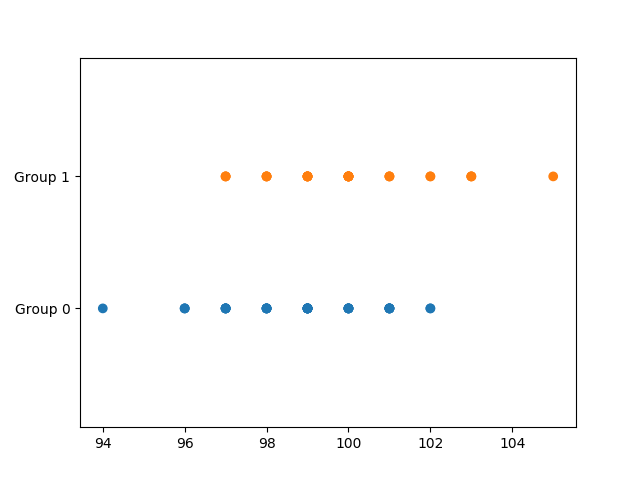

#### Model
To indicate this model in the config file, it is enough to set the arguments "Variable_type" to "Metric" in the "[Model]" section of the config file.

By indicating this model, the observation of two groups are assumed to follow two separate T-student distributions with parameters $$(mu, sigma)$$, corresponding to each group, and a share parameter nu. Each mu parameter is the indicator of overall performance of corresponding group, whereas sigma is how dispersed the value of the groups are and nu indicates how close the given distribution is to a normal distribution.  Thus the distribution of $$mu_1-mu_2$$ indicates how superior group one is over group two.
For a discussion on this model, including justfication and examples of usage refer to (Chapter 16 in the book 'Doing Bayesian Data Analysis: A Tutorial with R, JAGS, and Stan', Second Edition, by John Kruschke (2015).). It is worth noting the implementation in pymc3 is inspired by the code given in [https://github.com/JWarmenhoven/DBDA-python].

***
In a higher level, each mu is assumed to follow a wide normal distribution with identical parameters. Each sigma follows a wide uniform distribution and the shared parameter nu follows an exponential distribution. 

See a visualization of this model in Following Figure:


To check the effect of this model. One can see the Prior of distribution of each five parameters and their differences in the following Figure: 


Notice that before taking the observed data into account, our prior knowledge, in this case, is formalized as any reasonable value for each mu is almost equally likely. Since the domain of mu is the whole R, we can not assume an exactly uniform prior on it.

The package also combines the difference plots with the plot for nu in the following Figure:
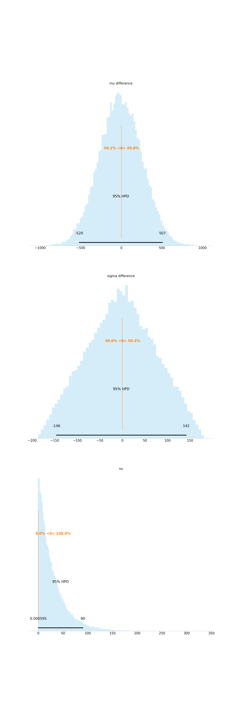
#### Posterior Plots
The main output of the analysis is the following Figure.

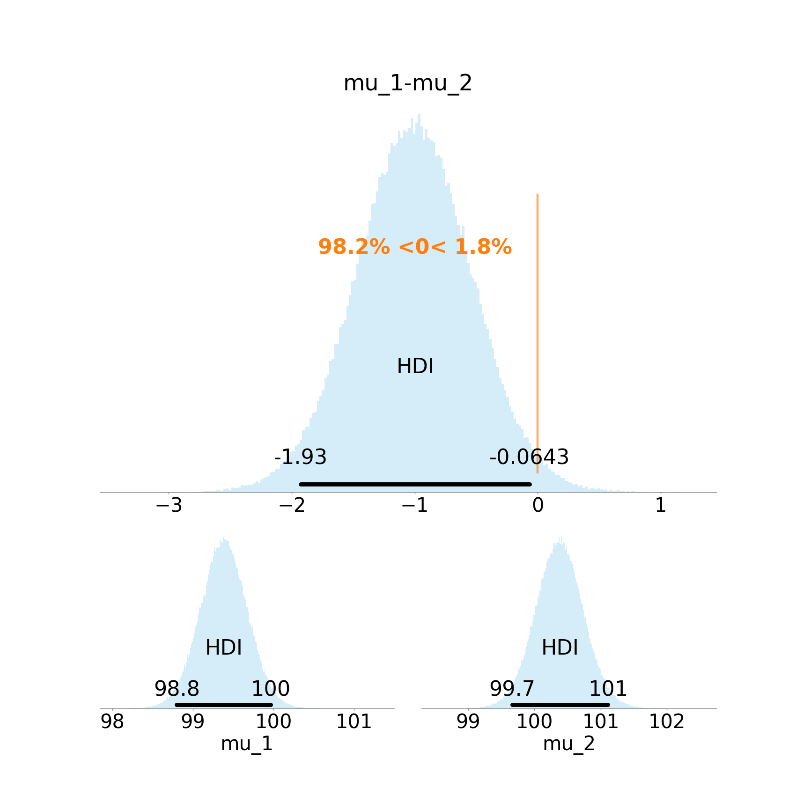


The information that can be read from this plot includes:
- XX


Similar to prior, we get more plots for the posterior too:
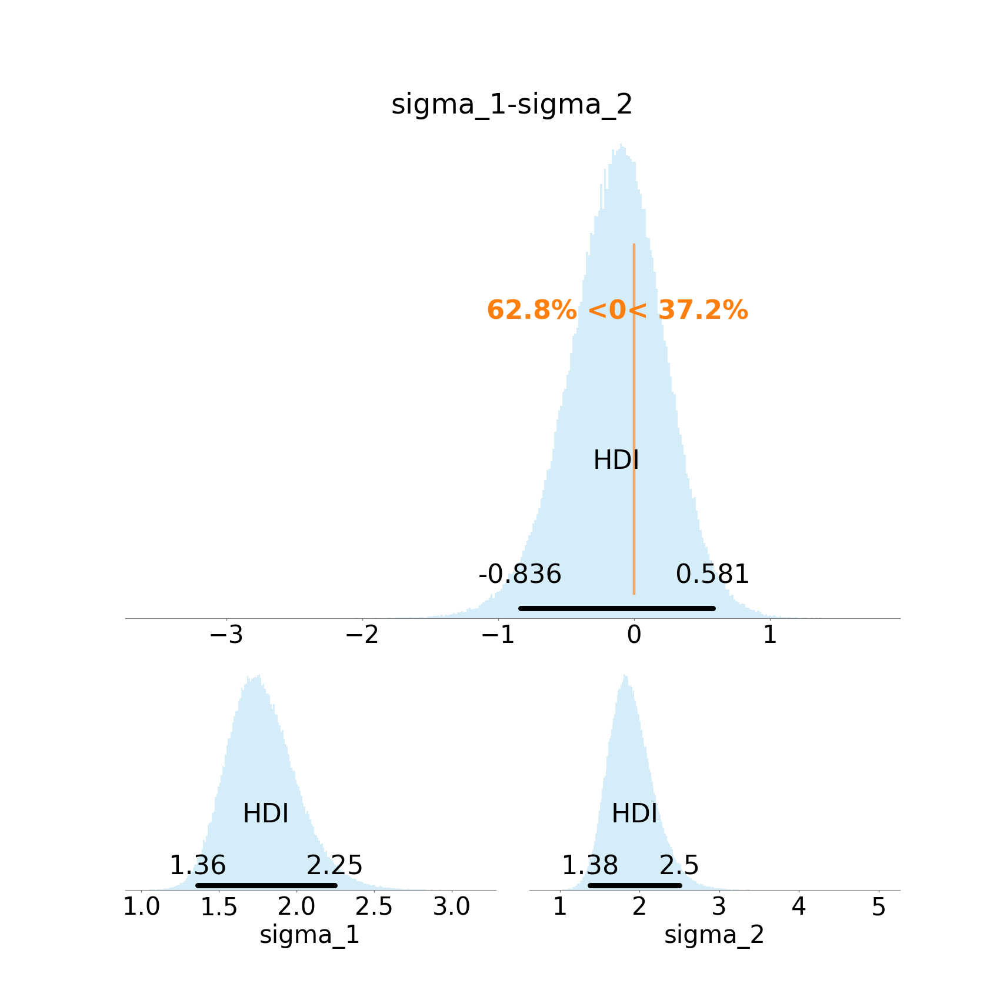


#### Diagnostic Plots
Since this package is based on MCMC sampling methods for infering the posteriour, it is important to make sure the sampling process has been done with sufficient granularity. For this purpose you can investigate the diagnastic plots produced by Pymc3:


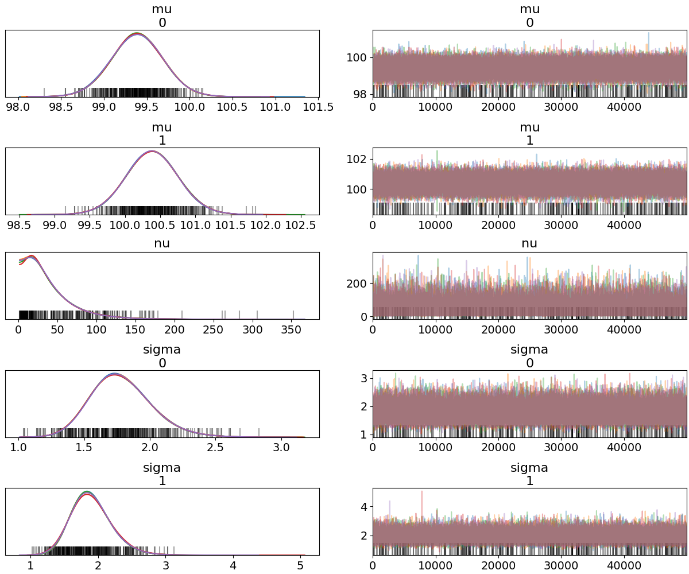

Notice that different chains for each parameter as converged to one distribution.


### Binary observations: Bernoulli distribution with Beta prior
For this model, you can indicate the "count_plot" and "bar_plot" to view a visualisation of the input. For our contrived data, we get the Figures 1 and 2.


#### Model
To indicate this model in the config file, it is enough to set the arguments "VariableType" and "PriorModel" to "Binary" and "Beta" in the "[Model]" section of the config file.

By indicating this model, the observations of two groups are assumed to be follow two separate Bernoulli distributions with parameters $$theta_1$$ and $$theta_2$$, corresponding to each group. Each parameter is the indicator of overall performance of corresponding group. Thus the distribution of $$theta_1-theta_2$$ indicates how superior group one is over group two. 


In a higher level, these two parameters are assumed to follow two Beta distribution with identical parameters. The parameters of this Beta distribution, i.e., priors of thetas, can be indicated with "Beta_a" and "Beta_b" in the "[Model]" section of the config file. Note setting both these parameters two one will result in a uniform prior.

See a visualization of this model in Following Figure:


To check the effect of this model. One can see the Prior of distribution of each theta and their difference in the following Figure: 


Notice that before taking the observed data into account, our prior knowledge, in this case, is formalized as any value between zero and one for each theta is equally likely.
#### Posterior Plots
The main output of the analysis is the following Figure.


Notice that the mode of the the difference of the distribution is at $$-0.238$$, also known as Maximum A priori Estimate, the %95-HDI quantifies the uncertainty around this mode, which is the main goal of this analysis.

Other information that can be read from this plot includes:
- The probability that group 2 is superior to group 1, i.e., $$Theta_2>Theta_1$$ is at least $$95%$$.
- 
#### Diagnostic Plots
Since this package is based on MCMC sampling methods for inferring the posterior, it is important to make sure the sampling process has been done with sufficient granularity. For this purpose you can investigate the diagnostic plots produced by Pymc3:


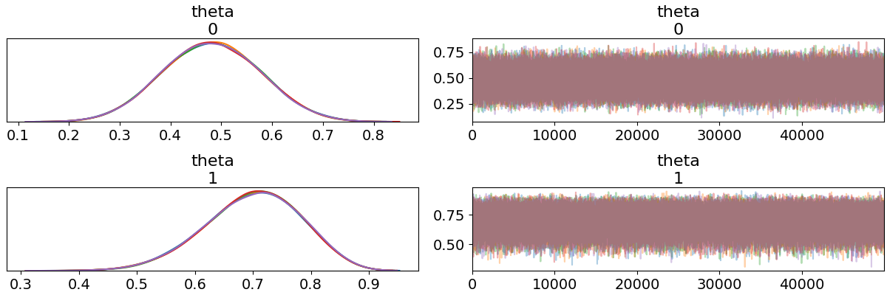

Notice that different chains for each parameter as converged to one distribution.

The parameters affecting granularity of the analysis can be indicated in sections "[Prior]" and "[Posteriour]" in the config file. Especially, the following three parameters are the most important ones:
- "Tune": number of samples to throw away in the beginning. A value of at least 500 is recommended.
- "Chains": number independent chains. Four chains seem to be sufficient to confirm successful convergence of the chains.
- "Draws": This is the number of samples used to plot the distribution. The higher this value, the smooth the plot will look like. Also you can consult the Effective Sample Size (ESS) printed in the log.

### Multiple Binary observations: Binomial distribution with Beta prior
For this model, you can indicate the "Histogram_plot" to view a visualisation of the input. For our contrived data, we get the following Figure.


#### Model
To indicate this model in the config file, it is enough to set the arguments "Variable_type" and "Prior_model" to "Binomial" and "Beta" in the "[Model]" section of the config file.

By indicating this model, the observations of two groups are assumed to be follow two separate Binomial distributions with parameters $$theta_1$$ and $$theta_2$$, corresponding to each group. Each parameter is the indicator of overall performance of corresponding group. Thus the distribution of $$theta_1-theta_2$$ indicates how superior group one is over group two. 


In a higher level, these two parameters are assumed to follow two Beta distribution with identical parameters. The parameters of this Beta distribution, i.e., priors of thetas, can be indicated with "Beta_a" and "Beta_b" in the "[Model]" section of the config file. Note setting both these parameters too ones will result in a uniform prior.

See a visualization of this model in Following Figure:


To check the effect of this model. One can see the Prior of distribution of each theta and their difference in the following Figure: 
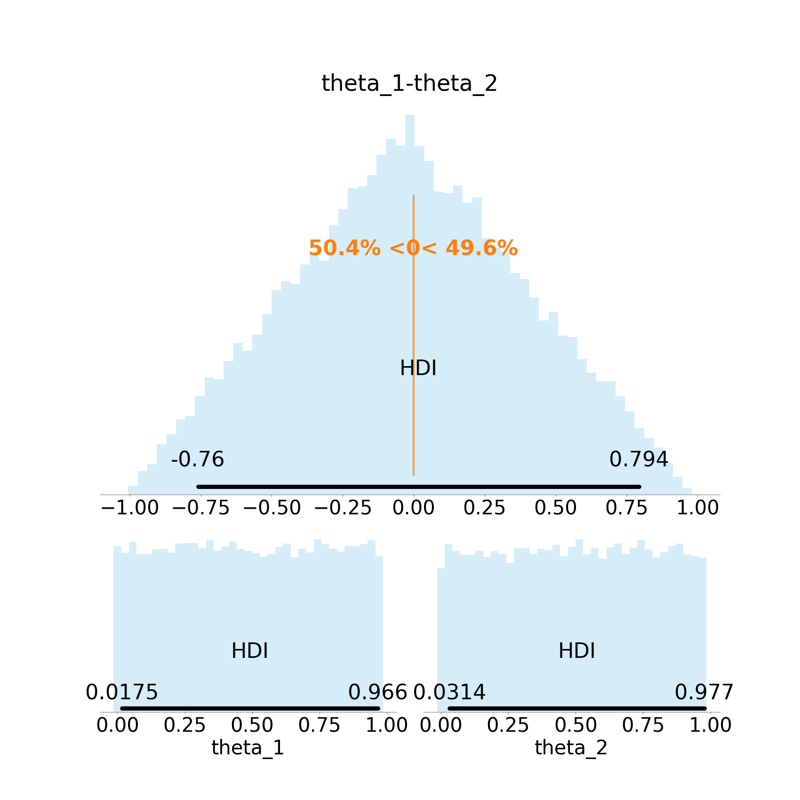

Notice that before taking the observed data into account, our prior knowledge, in this case, is formalized as any value between zero and one for each theta is equally likely.
#### Posterior Plots
The main output of the analysis is the following Figure.


Notice that the mode of the the difference of the distribution is at $$-0.238$$, also known as Maximum A priori Estimate, the %95-HDI quantifies the uncertainty around this mode, which is the main goal of this analysis.

Other information that can be read from this plot includes:
- (??)
- (??)
#### Diagnostic Plots
Since this package is based on MCMC sampling methods for inferring the posterior, it is important to make sure the sampling process has been done with sufficient granularity. For this purpose you can investigate the diagnostic plots produced by Pymc3:


Notice that different chains for each parameter as converged to one distribution.


### Count observations: Negative Binomial distribution with Normal prior
For this model, you can indicate the "Count_plot" and "scatter_plot" to view a visualisation of the input. For our contrived data, we get the following Figures.


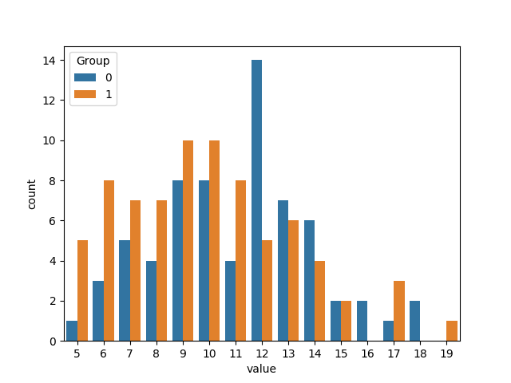

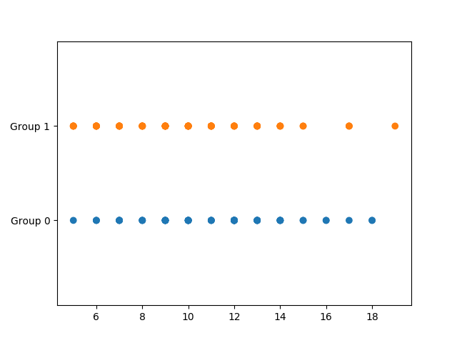

#### Model
To indicate this model in the config file, it is enough to set the arguments "Variable_type" to "Count" in the "[Model]" section of the config file.

By indicating this model, the observation of two groups are assumed to follow (TODO)?

***

For a discussion on this model, including justfication and examples of usage refer to (Chapter 24 in the book 'Doing Bayesian Data Analysis: A Tutorial with R, JAGS, and Stan', Second Edition, by John Kruschke (2015).). It is worth noting the implementation in pymc3 is inspired by the code given in [https://github.com/JWarmenhoven/DBDA-python].


See a visualization of this model in Following Figure:


To check the effect of this model. One can see the Prior of distribution of each five parameters and their differences in the following Figure: 

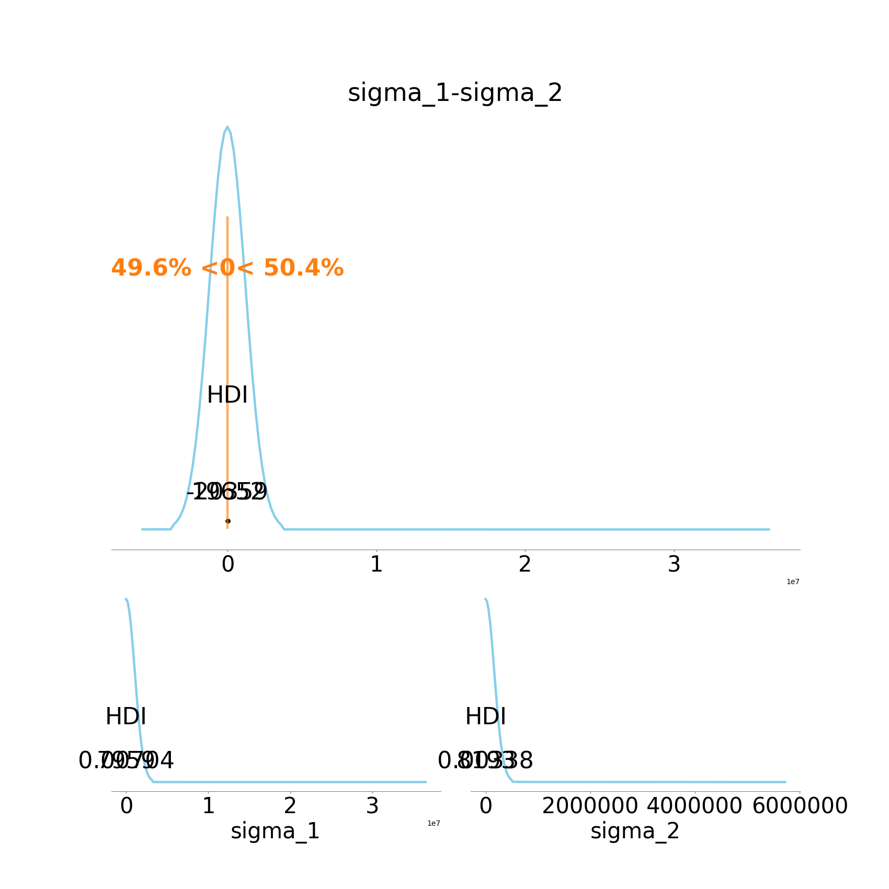


Notice that before taking the observed data into account, our prior knowledge, in this case, is formalized as any reasonable value for each mu is almost equally likely. Since the domain of mu is the whole R, we can not assume an exactly uniform prior on it.

The package also combines the difference plots with the plot for nu in the following Figure:


This includes effect size plot, for further information refer to https://en.wikipedia.org/wiki/Effect_size.
#### Posterior Plots
The main output of the analysis is the following Figure.


The information that can be read from this plot includes:
- XX


Similar to prior, we get more plots for the posterior too:


#### Diagnostic Plots
Since this package is based on MCMC sampling methods for infering the posteriour, it is important to make sure the sampling process has been done with sufficient granularity. For this purpose you can investigate the diagnastic plots produced by Pymc3:

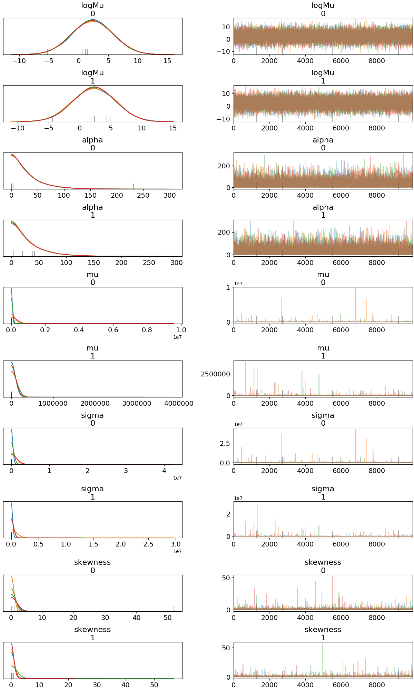


Notice that different chains for each parameter as converged to one distribution.

### Ordinal observations: Normal distribution with variable tresholds
For this model, you can indicate the "Count_plot" and "scatter_plot" to view a visualisation of the input. For our contrived data, we get the following Figures.


#### Model
To indicate this model in the config file, it is enough to set the arguments "Variable_type" to "Ordinal" in the "[Model]" section of the config file.

By indicating this model, the observation of two groups are assumed to follow (TODO)?

***
For a discussion on this model, including justfication and examples of usage refer to (Chapter 23 in the book 'Doing Bayesian Data Analysis: A Tutorial with R, JAGS, and Stan', Second Edition, by John Kruschke (2015)). It is worth noting the implementation in pymc3 is inspired by the code given in [https://github.com/JWarmenhoven/DBDA-python].


See a visualization of this model in Following Figure:


To check the effect of this model. One can see the Prior of distribution of each five parameters and their differences in the following Figure: 

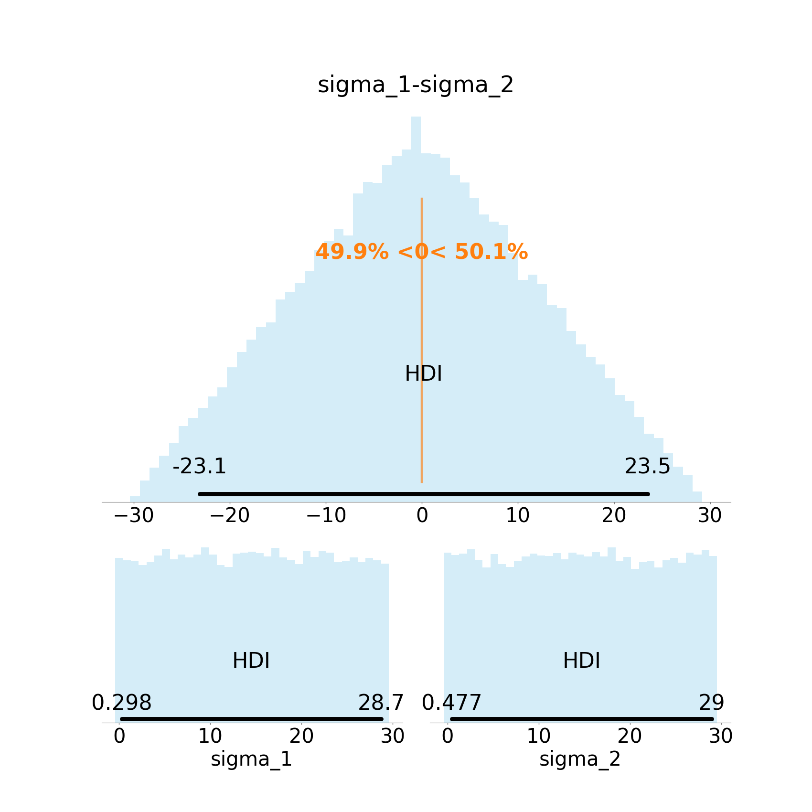


Notice that before taking the observed data into account, our prior knowledge, in this case, is formalized as any reasonable value for each mu is almost equally likely. Since the domain of mu is the whole R, we can not assume an exactly uniform prior on it.

The package also combines the difference plots with the plot for nu in the following Figure:


This includes effect size plot, for further information refer to https://en.wikipedia.org/wiki/Effect_size.
#### Posterior Plots
The main output of the analysis is the following Figure.


The information that can be read from this plot includes:
- XX


Similar to prior, we get more plots for the posterior too:


#### Diagnostic Plots
Since this package is based on MCMC sampling methods for infering the posteriour, it is important to make sure the sampling process has been done with sufficient granularity. For this purpose you can investigate the diagnastic plots produced by Pymc3:


Notice that different chains for each parameter as converged to one distribution.

## Adding a new Model
To add a new model, you need to add a file in the director models. See similar implimentations in that file.

### Bayes Factor (BF) Analysis
Also known as Bayesian hypothesis testing.
The package also outputs the Bayes Factor for several lengths of intervals around the ROPE.
(TODO)

