# User Manual for HyBayes

## Table of contents
- [Introduction](#introduction)
- [Installation](#installation)
- [Preparing Synthetic Data](#preparing-synthetic-data)
- [Prepare Configuration File](#preparing-configuration-files)
- [Running the analysis](#running-the-analysis)
- [Implemented Models](#Implemented-Models)
  * [An example of model 1: Binary Model](#binary-observations-bernoulli-distribution-with-beta-prior)
  * [An example of model 2: Binomial Model](#multiple-binary-observations-binomial-distribution-with-beta-prior)
  * [An example of model 3: Metric Model](#metric-observations-t-student-distribution-with-multiple-choices-for-priors)
  * [An example of model 4: Count Model](#count-observations-negative-binomial-distribution-with-normal-prior)
  * [An example of model 5: Ordinal Model](#ordinal-observations-normal-distribution-with-variable-tresholds)
- [Adding your own models](#adding-a-new-model)

## Introduction 
The goal of this package is to facilitate the performance comparison of two algorithms, based on given observations.
In [the paper](README.md#citation) we review four different approaches to assess a hypothesis (see the four different cells in the figure below). However, here we focus on two Bayesian approaches (a) inference with posterior probabilities (b) Bayes Factors. Both these approaches help a researcher claim superiority of one algorithm over another from different aspects.

<p align="center">
    
</p>

## Installation
Checkout the main [README](../README.md#installation) file.

## Preparing Synthetic Data
For purposes of this manual, we make synthetic data. 
If you already have your data (as observations) from your experiments, you can skip this step.

Use the following command to  generate the artificial data: 

```bash
 > python make_data.py
```

## Preparing Configuration Files
To analyze your data, you need to prepare the a configuration file that specifies the information needed for the analysis (e.g., the address to your observation files, the type of plots and files you want to be stored).

The following snippet shows the general structure of a configuration file. The main sections are `Files`, `Plots`, `Model`, `Bayes_factor`, `Prior`, and `Posterior`. You can find examples of complete configurations in [`configs`](configs) folder, after running `make_configs.py`.

The first section of the configuration file is `Files` and it indicates the information for the files which contain 
your experimental result. For most common usages of our package, you will provide 2 files with single column in each (that is first two lines. The results of the analaysis will be stored in the address specified by `output_prefix`.   
The rest of the lines in this section indicate the names and the location of two (or any number of) files, which inlucde the result of your experiments. 

```bash
[Files]
number_of_columns = 1
number_of_files = 2
output_prefix = metric_experiment_files/Metric
file1 = artificial_data/Positive_real_data_0.csv
file2 = artificial_data/Positive_real_data_1.csv

[Plots]
...

[Model]
Variable_type = Metric
...

[Bayes_factor]
analyze = False
...

[Prior]
Analyze = True
...

[Posterior]
Analyze = True
...
```

The parameters affecting granularity of the analysis can be indicated in `[Prior]` and `[Posteriour]` sections in the config file. 

Many of the parameters specify the details of [the sampling algrithm](https://en.wikipedia.org/wiki/Markov_chain_Monte_Carlo) (which is used to infer the posterior probabilities).  In particular, the following three parameters are the most important ones:
- `Tune`: the number of samples to throw away in the beginning of the sampling. A value of, at least, 500 is recommended.
- `Chains`: the number independent chains. At least four chains seem to be sufficient to confirm successful convergence of the chains.
- `Draws`: the number of samples used to plot the distribution. The higher this value is, the smoother the plot will look like. You can also consult the Effective Sample Size (ESS) printed in the output logs.


## Running the analysis 
Checkout the main [README](../README.md#running-the-analysis) file.

## Output files
Depending on the types of analyses the user asks (via configuration file) a subset of following files/folders will be stored as the output of the analysis. Note that all the files will have a prefix that is specific to the whole analysis.

- **`posterior_trace`** : A directory where all the samples (collected using `pymc3` engine) for the *posterior* distribution is stored for further analysis. In the literature, these samples are referred to as "trace", "chain", or "samples". 
For regular usages, you don't need to touch these files. However, if you're deadling with complex models that involve long chains, re-using the trace could save time for future analyses (by not re-running the sampling process again).
For reproducablity of your results, it also highly recommended that you make the contents of this directory available for public for further investigations.
- **`prior_trace`** : A directory where all the samples (collected using `pymc3` engine) for the *prior* distribution is stored for further analysis. See `posterior_trace` for more info.
- **`config.ini`** : The user's desired configuration file is also copied alongside other output files, for reproducibility and ease of future references.
- **`log.log`** : The log of the analysis is stored in this file for debugging purposes.
- **`posterior_hierarchical_graph.png`** : A pictorial representation of the hierarchical model used in the analysis. This file is created using the `model_to_graphviz` in `pymc3`. To understand the notation refer to their docs ([link 1](https://graphviz.readthedocs.io/en/stable/manual.html), [link 2](https://github.com/pymc-devs/pymc3/blob/master/pymc3/model_graph.py)).
- **`posterior_hierarchical_graph.txt`** : A textual representation of the hierarchical model corresponding to `posterior_hierarchical_graph.png`.
- **`posterior_diagnostics.png`** and **`prior_diagnostics.png`** : The diagnostics plots drawn using [`pymc3`'s diagnostic](https://docs.pymc.io/api/diagnostics.html) tools. It is recommended to include these plots in the supplementary material section of the paper to convince the reader that the sampling process was successful.
- **`count_plot.png`**, **`bar_plot`**, **`histogram_plot`**, or **`scatter_plot`**: These plots basic visualizations of the raw data. Often these plots help match the result of Bayesian analysis to the given data.  
 

## Implemented Models
Current versioin of the package provides 5 pre-implimented models:
- Binary observations: Bernoulli distribution with a Beta prior
- Multiple Binary observations: Binomial distribution with a Beta prior
- Metric observations: T-Student distribution with muliple priors
- Count observations: Negative Binomial distribution with a Normal prior
- Ordinal observations: Normal distribution with variable tresholds

The table below describes a summary of common settings these hierarchical models could be used: 


These models capture a lot of common assumption on observed data. Note that if you have specific information on your observation or other assumptions, it is highly recommended that you add your costum model. If you have model in mind that is a general model and other researchers (expecially within NLP community) are likely to need, feel free to ask us to add to the pakcage.


***

### Binary observations: Bernoulli distribution with Beta prior
For this model, you can indicate the `count_plot` and `bar_plot` to view a visualization of the input. For our contrived data, we get the following two figures. 

<p align="center">
    
    
</p>

#### Model
To indicate this model in the config file, it is enough to set the arguments `VariableType` and `PriorModel` to `Binary` and `Beta`, respectively, in the `[Model]` section of the config file.

By indicating this model, the observations of two groups are assumed to be follow two separate Bernoulli distributions with parameters `theta_1` and `theta_2`, corresponding to each group. Each parameter is the indicator of overall inherent performance of corresponding group. Thus the distribution of `theta_1-theta_2` indicates how superior group one is over group two. 


In a higher level, these two parameters are assumed to follow two Beta distributions with identical parameters. The parameters of this Beta distribution (i.e. priors of thetas) can be indicated with `Beta_a` and `Beta_b` in the `[Model]` section of the config file. Note setting both of these parameters to one will result in a uniform prior.

See a visualization of this model in following figure:
<p align="center">
    
</p>

To check the effect of this model. One can see the Prior of distribution of each theta and their difference in the following figure: 
<p align="center">
    
</p>

Notice that before taking the observed data into account, our prior knowledge, in this case, is formalized as any value between zero and one for each theta is equally likely.

#### Posterior Plots
The main output of the analysis is the following figure: 

<p align="center">
    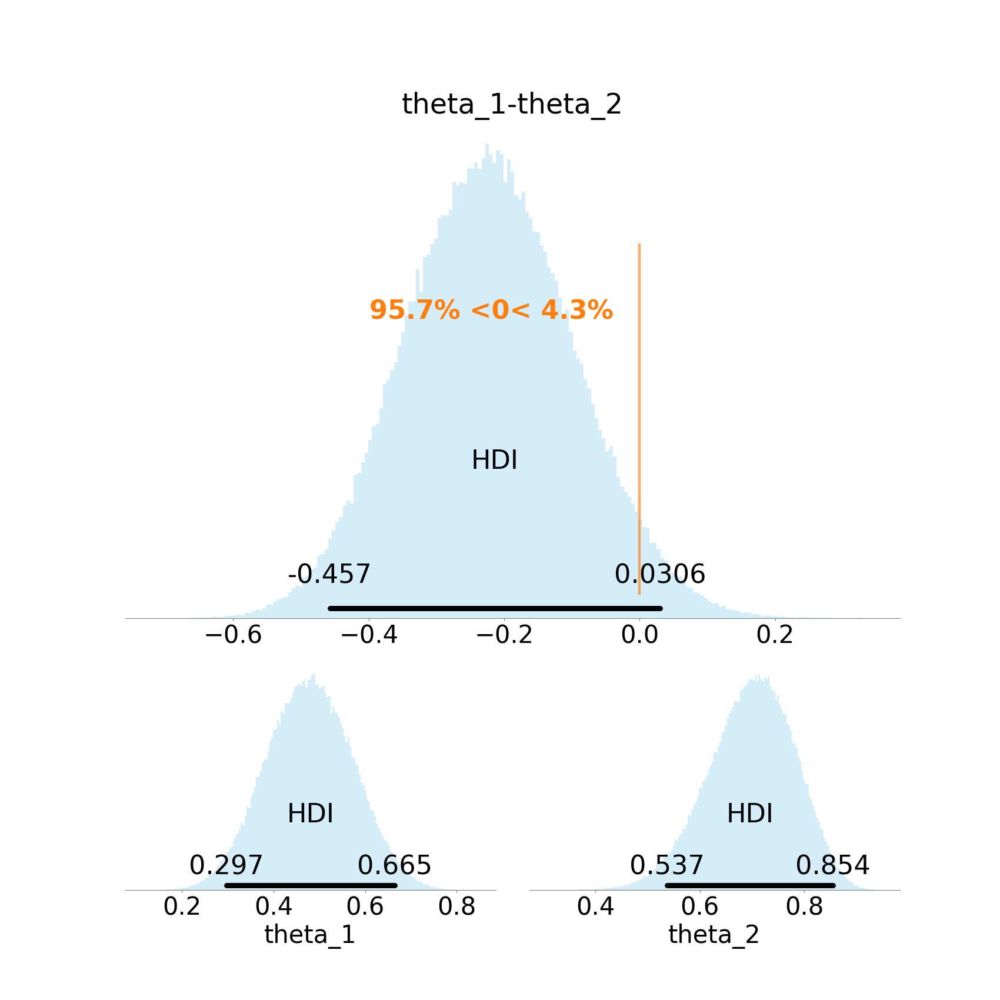
</p>


Notice that the mode of the the difference of the distribution is at -0.238, also known as Maximum A priori Estimate, the %95-HDI quantifies the uncertainty around this mode, which is the main goal of this analysis.

Other information that can be read from this plot includes:
- The probability that group 2 is superior to group 1, i.e., `Theta_2>Theta_1` is at least 95%.
- 
#### Diagnostic Plots
Since this package is based on MCMC sampling methods for inferring the posterior, it is important to make sure the sampling process has been done with sufficient granularity. For this purpose you can investigate the diagnostic plots produced by `pymc3`:

<p align="center">
    
    
</p>

Notice that different chains for each parameter as converged to one distribution.

The parameters affecting granularity of the analysis can be indicated in sections `[Prior]` and `[Posteriour]` in the config file. Especially, the following three parameters are the most important ones:
- "Tune": number of samples to throw away in the beginning. A value of at least 500 is recommended.
- "Chains": number independent chains. Four chains seem to be sufficient to confirm successful convergence of the chains.
- "Draws": This is the number of samples used to plot the distribution. The higher this value, the smooth the plot will look like. Also you can consult the Effective Sample Size (ESS) printed in the log.

*** 

### Multiple Binary observations: Binomial distribution with Beta prior
For this model, you can indicate the "Histogram_plot" to view a visualization of the input. For our contrived data, we get the following figure.

<p align="center">
    
</p>


#### Model
To indicate this model in the config file, it is enough to set the arguments `Variable_type` and `Prior_model` to `Binomial` and `Beta`, respectively, in the `[Model]` section of the config file.

By indicating this model, the observations of two groups are assumed to be follow two separate Binomial distributions with parameters `theta_1` and `theta_2`, corresponding to each group. Each parameter is the indicator of overall performance of corresponding group. Thus the distribution of `theta_1-theta_2` indicates how superior group one is over group two. 


In a higher level, these two parameters are assumed to follow two Beta distribution with identical parameters. The parameters of this Beta distribution, i.e., priors of thetas, can be indicated with `Beta_a` and `Beta_b` in the `[Model]` section of the config file. Note setting both these parameters too ones will result in a uniform prior.

See a visualization of this model in following figure:
<p align="center">
    
</p>


To check the effect of this model. One can see the Prior of distribution of each theta and their difference in the following figure: 
<p align="center">
    
</p>


Notice that before taking the observed data into account, our prior knowledge, in this case, is formalized as any value between zero and one for each theta is equally likely.

#### Posterior Plots
The main output of the analysis is the following Figure.

<p align="center">
    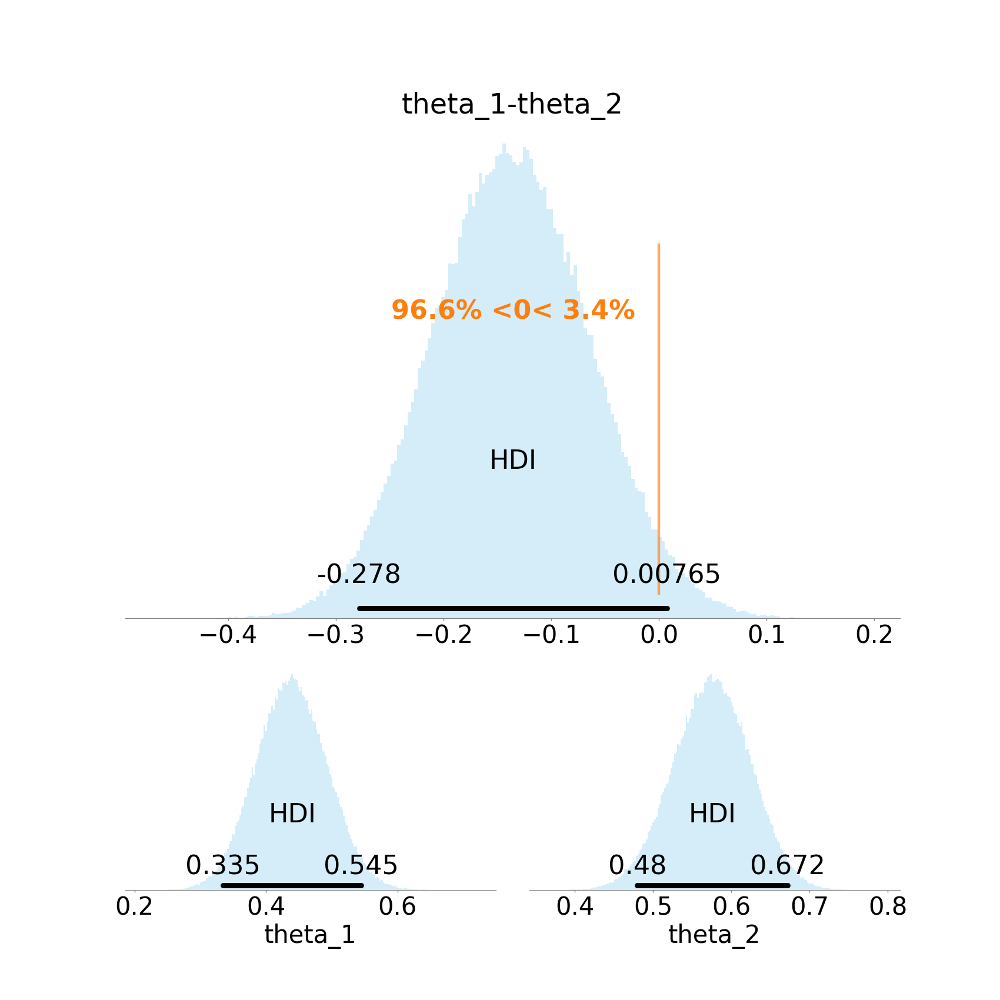
</p>

Notice that the mode of the the difference of the distribution is at -0.238, also known as Maximum A priori Estimate, the %95-HDI quantifies the uncertainty around this mode, which is the main goal of this analysis. Moreover, With probablity 9.966, theta_2 is greater than theta_1.

#### Diagnostic Plots
Since this package is based on MCMC sampling methods for inferring the posterior, it is important to make sure the sampling process has been done with sufficient granularity. For this purpose you can investigate the diagnostic plots produced by `pymc3`:

<p align="center">
    
    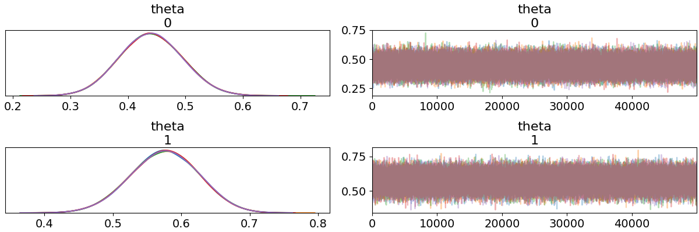
</p>

Notice that different chains for each parameter as converged to one distribution.

*** 


### Metric observations: T-Student distribution with multiple choices for priors
For this model, you can indicate the "Histogram_plot" and "scatter_plot" to view a visualization of the input. For our contrived data, we get the following figures:

<p align="center">
    
    
</p>


#### Model
To indicate this model in the config file, it is enough to set the `Variable_type` argument to `Metric` in the `[Model]` section of the config file.

By indicating this model, the observation of two groups are assumed to follow two separahte T-student distributions with parameters (`mu`, `sigma`, corresponding to each group) and a shared parameter `nu`: 

 - Each `mu` parameter is the indicator of overall performance of corresponding group. Thus the distribution of `mu_1-mu_2` indicates how superior group one is over group two.  
 - The parameter `sigma` shows the dispersionof the value of the groups. 
 - The parameter `nu` indicates how close the given distribution is to a normal distribution.  

For a discussion on this model, including justfication and examples of usage refer to (Chapter 16 of) the book "Doing Bayesian Data Analysis: A Tutorial with R, JAGS, and Stan" (Second Edition) by John Kruschke (2015). 

#### Prior Plots 
In a higher level, each mu is assumed to follow a wide normal distribution with identical parameters. Each sigma follows a wide uniform distribution and the shared parameter nu follows an exponential distribution. 

See a visualization of this model in Following Figure:
<p align="center">
    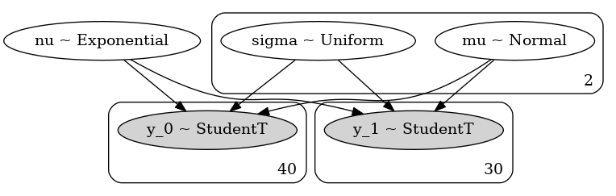
</p>


To check the effect of this model. One can see the Prior of distribution of each five parameters and their differences in the following Figure: 
<p align="center">
    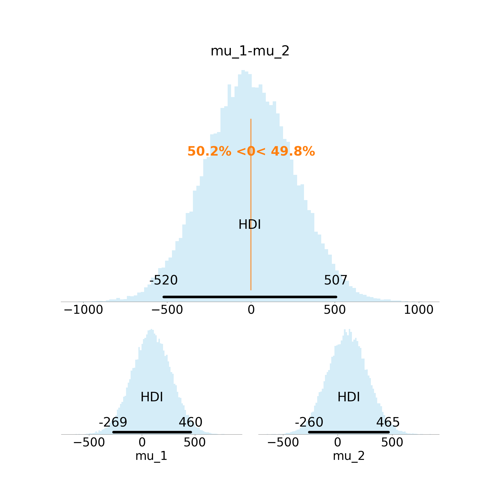
    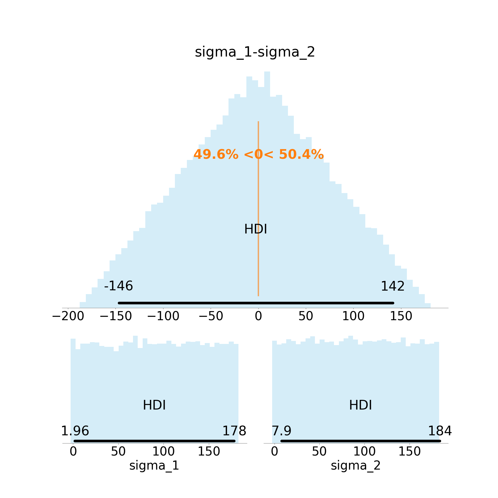
</p>


Notice that before taking the observed data into account, our prior knowledge, in this case, is formalized as any reasonable value for each mu is almost equally likely. Since the domain of mu is the whole R, we can not assume an exactly uniform prior on it.

The package also combines the difference plots with the plot for nu in the following figure:

<p align="center">
    
</p>


#### Posterior Plots
The main output of the analysis is the following Figure.

<p align="center">
    
</p>


The information that can be read from this plot includes:
- Most likly value for mu_1 - mu_2 is -0.993.
- With probablity 0.95, mu_1 - mu_2 is a value in [-1.93, -0.643].
- With probablity 0.982, mu_1 is smaller than mu_2.


Similar to prior, we get more plots for the posterior too:
<p align="center">
    
    
</p>

Beside the centerality parameters, it is highly recommended to discuss other parameters too. For example, according to the above difference plot for sigma, on one hand it is almost twice probable for sigma_2 to be greater than sigma_1. On the other hand, with 0.95 probablity the difference of two sigmas are in [-0.836, 0.581]. One can interpret this as the lack of notable difference in deviation the two groups of observations.

#### Diagnostic Plots
Since this package is based on MCMC sampling methods for infering the posteriour, it is important to make sure the sampling process has been done with sufficient granularity. For this purpose you can investigate the diagnastic plots produced by `pymc3`:

<p align="center">
    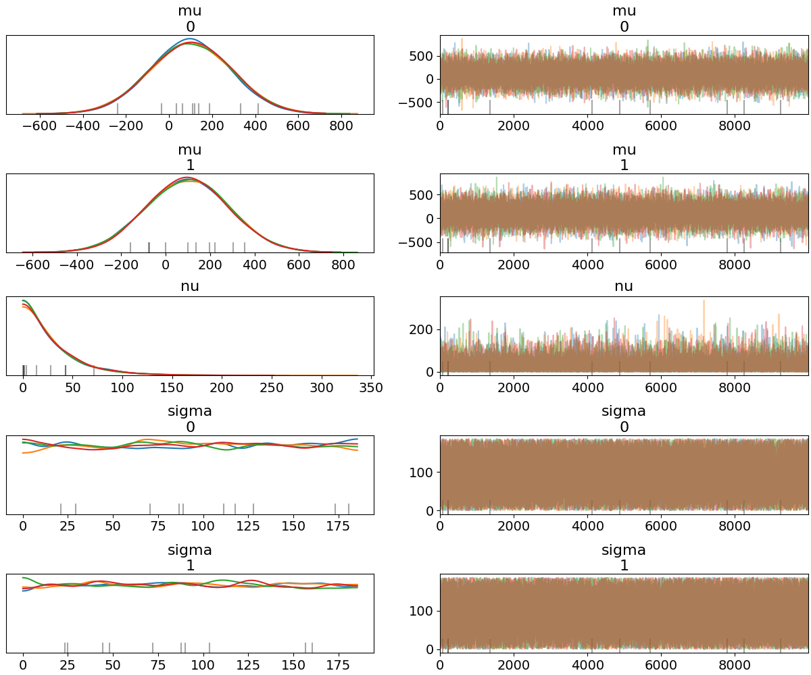
    
</p>

Notice that different chains for each parameter as converged to one distribution.

*** 


### Count observations: Negative Binomial distribution with Normal prior
For this model, you can indicate the "Count_plot" and "scatter_plot" to view a visualization of the input. For our contrived data, we get the following figures:

<p align="center">
    
    
</p>

#### Model
To indicate this model in the config file, it is enough to set the `Variable_type` to `Count` arguments in the `[Model]` section of the config file.

By indicating this model, the observation of two groups are assumed to follow a negative binomial distribution with seperate mu and alpha for each group. Since it is not easy to interpret alpha parameter of negative binomial distribution, we calculate "sigma" and "skewness" as deterministic functions of "alpha" and "mu."

In the upper level, as the prior, since mu needs to be possitive, its logarithm is assumed to follow Normal distribution, whereas alpha is assumed to follow exponential distribution.

For a discussion on this model, including justfication and examples of usage refer to (Chapter 24 in the book 'Doing Bayesian Data Analysis: A Tutorial with R, JAGS, and Stan', Second Edition, by John Kruschke (2015).). It is worth noting the implementation in `pymc3` is inspired by the code given in [https://github.com/JWarmenhoven/DBDA-python].


See a visualization of this model in the following figure:
<p align="center">
    
</p>
The posteroiur plots in this section are configured to be `kde` type compared to default `hist` just to see this version too. This can be set in the config file, section `plots`, variable `kind`.

To check the effect of this model. One can see the Prior of distribution of each five parameters and their differences in the following figure: 

<p align="center">
    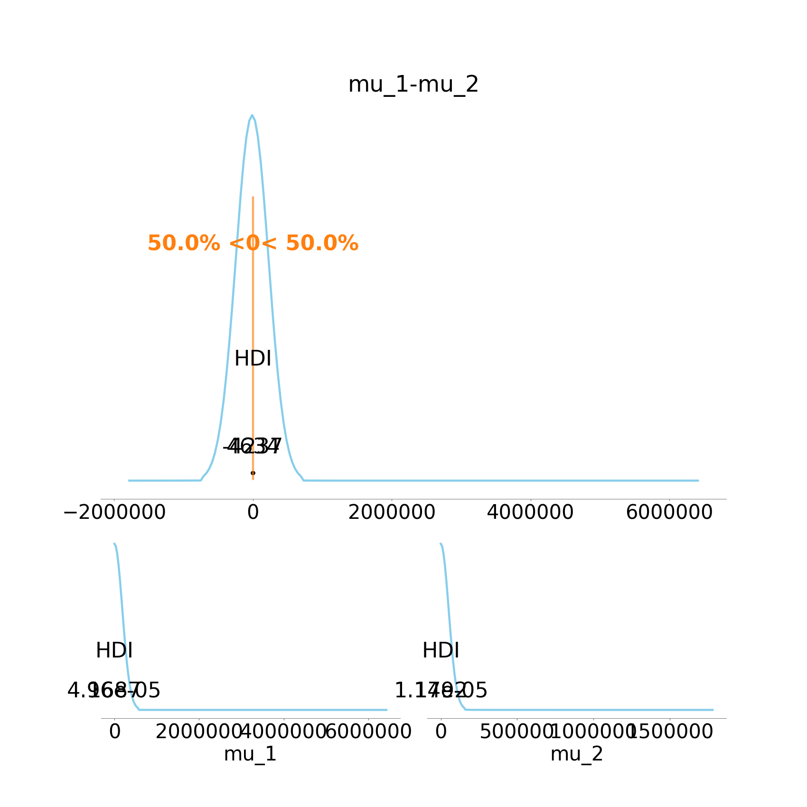
    
</p>

Notice that before taking the observed data into account, our prior knowledge, in this case, is formalized as any reasonable value for each mu is almost equally likely. Since the domain of mu is the whole R, we can not assume an exactly uniform prior on it.

The package also combines the difference plots with the plot for nu in the following Figure:
<p align="center">
    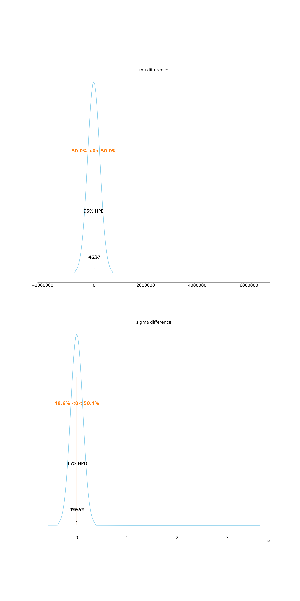
</p>

This includes effect size plot, for further information refer to https://en.wikipedia.org/wiki/Effect_size.


#### Posterior Plots
The main output of the analysis is the following Figure.

<p align="center">
    
</p>


Similar to prior, we get more plots for the posterior too:
<p align="center">
    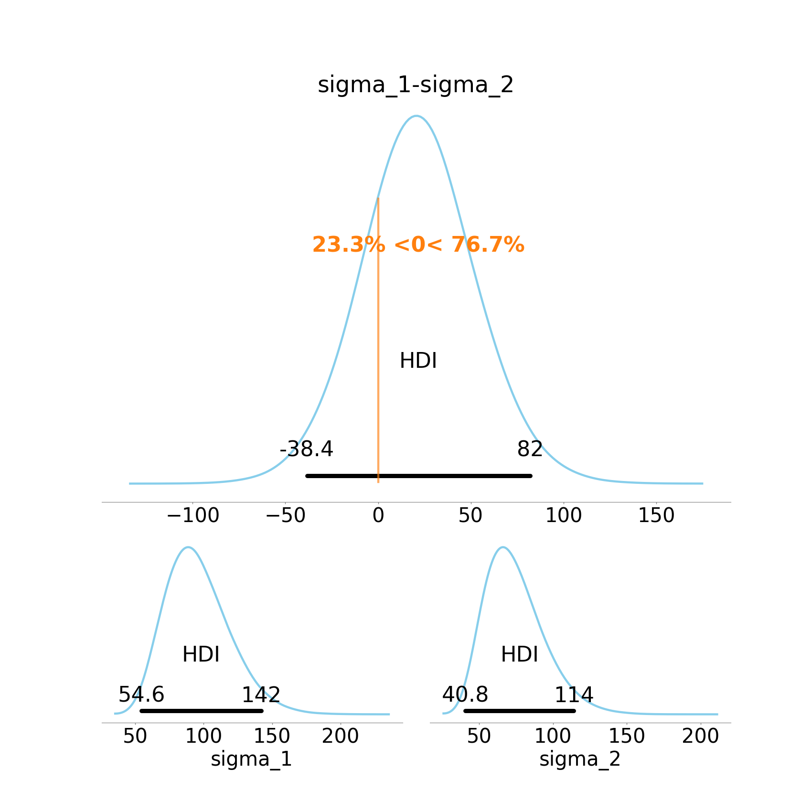
    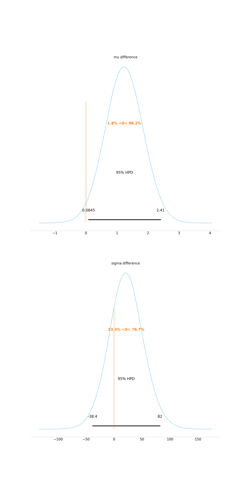
</p>

#### Diagnostic Plots
Since this package is based on MCMC sampling methods for infering the posteriour, it is important to make sure the sampling process has been done with sufficient granularity. For this purpose you can investigate the diagnastic plots produced by `pymc3`:

<p align="center">
    
    
</p>

Notice that different chains for each parameter as converged to one distribution.

### Ordinal observations: Normal distribution with variable tresholds
For this model, you can indicate the "Count_plot" to view a visualization of the input. For our contrived data, we get the following Figures.

<p align="center">
    
</p>

#### Model
To indicate this model in the config file, it is enough to set the arguments `Variable_type` to `Ordinal` in the `[Model]` section of the config file.

By indicating this model, we assume each level, i.e., possible values for the observations,
is a representitive for an interval from real line,
such that the intervals for all levels partition the whole real line.
The intervals are half open finite lengths except the first level and the last with some latent thresholds. The interval corresponding to the first level is assumed to be from negative infinity to a threshold.
This allows us to study a latent space with a distance.


For a discussion on this model, including justfication and examples of usage refer to (Chapter 23 in the book 'Doing Bayesian Data Analysis: A Tutorial with R, JAGS, and Stan', Second Edition, by John Kruschke (2015)). It is worth noting the implementation in `pymc3` is inspired by the code given in [https://github.com/JWarmenhoven/DBDA-python].


See a visualization of this model in the following figure:
<p align="center">
    
</p>


To check the effect of this model. One can see the Prior of distribution of each five parameters and their differences in the following figure: 
<p align="center">
    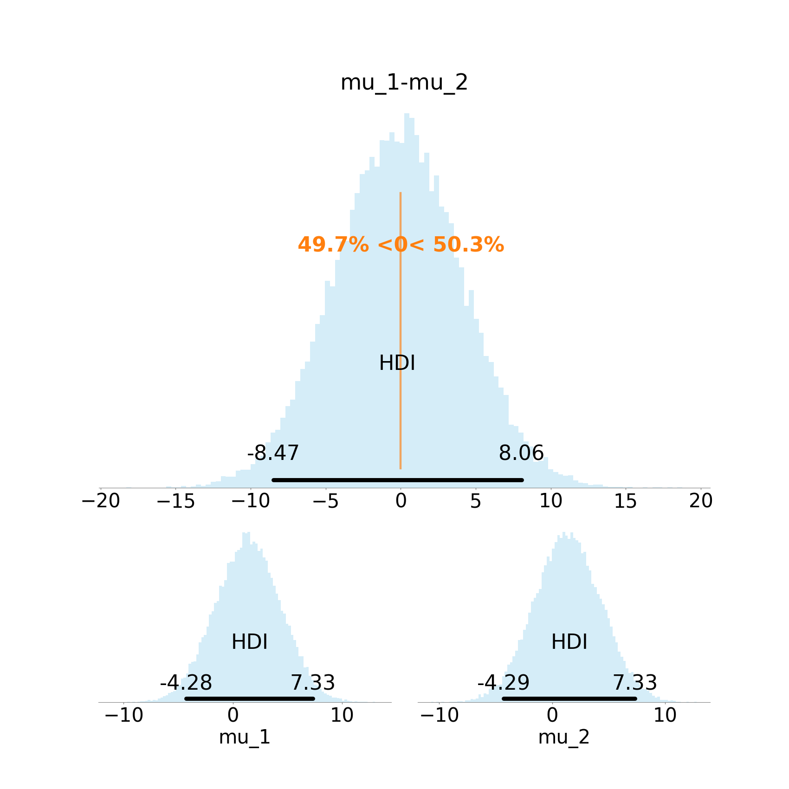
    
</p>


Notice that before taking the observed data into account, our prior knowledge, in this case, is formalized as any reasonable value for each mu is almost equally likely. Since the domain of mu is the whole R, we can not assume an exactly uniform prior on it.

The package also combines the difference plots with the plot for nu in the following figure:
<p align="center">
    
</p>

This includes effect size plot, for further information refer to https://en.wikipedia.org/wiki/Effect_size.

#### Posterior Plots
The main output of the analysis is the following figure:
<p align="center">
    
</p>


The information that can be read from this plot includes:
- With probablity 0.987, mu_1 is greater than mu_2.
- With probablity 0.95, mu_1-mu_2 in [0.409, 8.55]. One can claim that the first group is inherently bettern than the second group by a margin of higher than 0.4.

Similar to prior, we get more plots for the posterior too:
<p align="center">
    
    
</p>


#### Diagnostic Plots
Since this package is based on MCMC sampling methods for infering the posteriour, it is important to make sure the sampling process has been done with sufficient granularity. For this purpose you can investigate the diagnastic plots produced by `pymc3`:

<p align="center">
    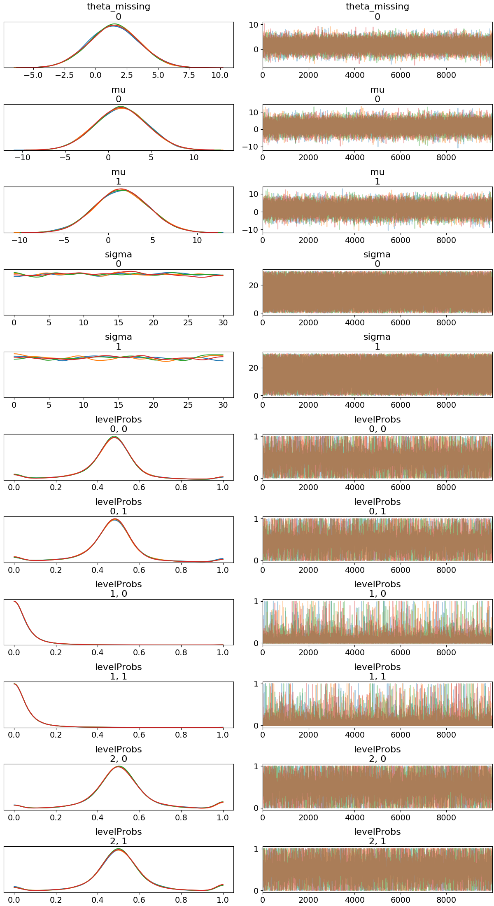
    
</p>


Notice that different chains for each parameter as converged to one distribution.

## Adding a new Model
Currently, adding a new model is only possible if you clone this repository. You need to add a file in the `models` directory. See similar implimentations in that directory.

### Bayes Factor (BF) Analysis
Another common approach to assess hypotheses within Bayesian approach is to study a quantity known as Bayes Factor. This approach is widly refered to as Bayesian hypothesis testing. In the [the paper](README.md#citation), this approach is discussed in Section 2.4.
Indicating your interested in Bayes Factor Analysis in the config file is easy. First you need to indicate that both Prior and Posteriour analyses are `True`. Then, you may indicate some settings in `Bayes_factor` section.
```
[Bayes_factor]
analyze = True
number_of_smaller_ropes = 5
theta_rope_begin = -0.1
theta_rope_end = 0.1
```
This section of the config file starts with turning on analysis in the first line. Recall that this line is not enough to run Bayes Factor Analysis unless both prior and poesteriour analyses are on too. For each parameter you can indicate a [ROPE](http://doingbayesiandataanalysis.blogspot.com/2013/08/how-much-of-bayesian-posterior.html) similar to the last two lines I have indicated. Also optionally, you can ask for the estimation of BF be done for a few smaller ROPEs too with `number_of_smaller_ropes`.

The output of this analysis can be found in the log file and in a csv file with name `{prefix}_Bayes_factor.csv`. For example when the software is run for the binomial example above we may see the following:
```
************************* Bayes Factor Analysis *********************************
Estimated Bayes factor corresponding to ROPE = [-0.1  0.1] is equal to 1.723621984974298
To get a trusted estimation, make sure the number of draws is high enough and multiple runs of the software give similar estimate
To interpret the Bayes factor refer to the table in https://www.r-bloggers.com/what-does-a-bayes-factor-feel-like/
Here are values for Bayes factors for other smaller ROPE intervals:
                                            ROPE        BF
0                                    [-0.1, 0.1]  1.723622
1    [-0.08333333333333334, 0.08333333333333334]  1.576957
2    [-0.06944444444444446, 0.06944444444444446]  1.454396
3  [-0.057870370370370385, 0.057870370370370385]  1.376417
4    [-0.04822530864197532, 0.04822530864197532]  1.312773
*********************************************************************************

```
Notice the BF of almost 1 (i.e., very neutral) in the first line. You may refer to the link given above to interpret this value.
